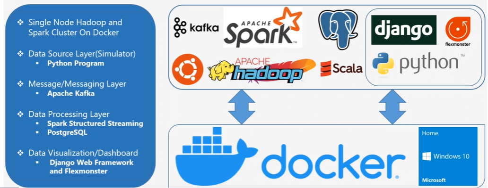
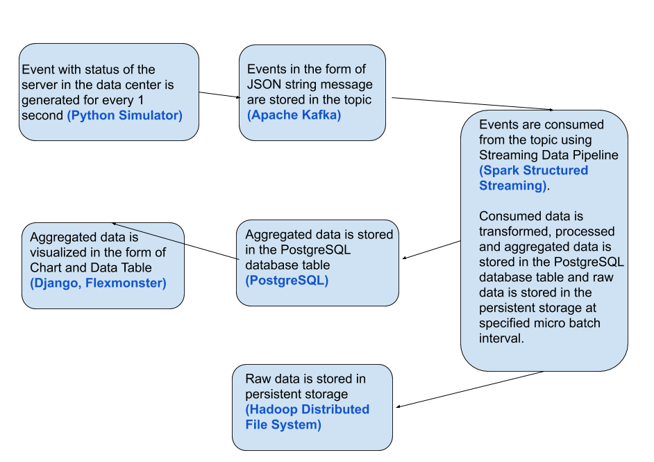
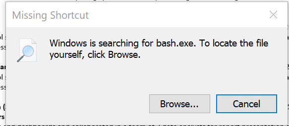
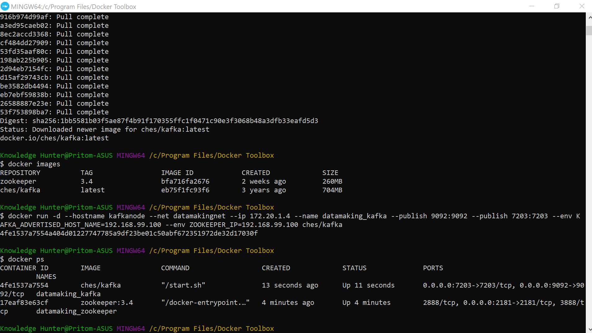
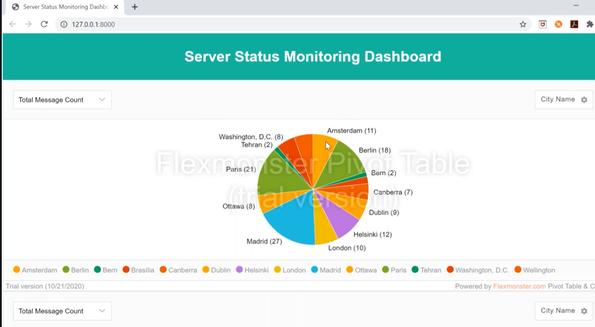
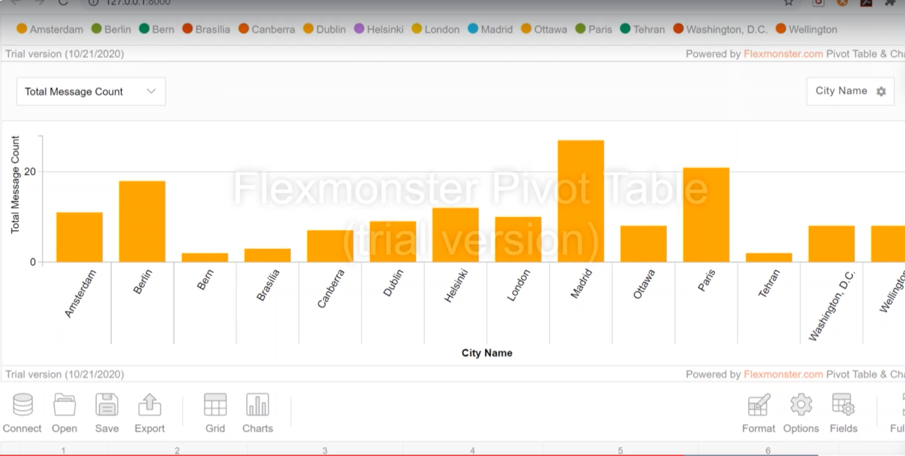

[![LinkedIn][linkedin-shield]][linkedin-url]

<!-- PROJECT LOGO -->
 

  
<h2 align="center"><i>Building Streaming Data Pipeline using Apache Hadoop, Apache Spark and Kafka on Docker</i></h2>

> Apache Hadoop, Apache Spark, Apache ZooKeeper, Kafka, Scala, Python, PySpark PostgreSQL, Docker, Django, Flexmonster, Real Time Streaming, Data Pipeline, Dashboard

<!-- ABOUT THE PROJECT -->

## About The Project
Building Real Time Data Pipeline Using Apache Kafka, Apache Spark, Hadoop, PostgreSQL, Django and Flexmonster on Docker

### Project Description

* In many data centers, different type of servers generate large amount of data(events, Event in this case is status of the server in the data center) in real-time.

* There is always a need to process these data in real-time and generate insights which will be used by the server/data center monitoring people and they have to track these server's status regularly and find the resolution in case of issues occurring, for better server stability.

* Since the data is huge and coming in real-time, we need to choose the right architecture with scalable storage and computation frameworks/technologies.

* Hence we want to build the Real Time Data Pipeline Using Apache Kafka, Apache Spark, Hadoop, PostgreSQL, Django and Flexmonster on Docker to generate insights out of this data.

* The Spark Project/Data Pipeline is built using Apache Spark with Scala and PySpark on Apache Hadoop Cluster which is on top of Docker.

* Data Visualization is built using Django Web Framework and Flexmonster.

### Use Case Diagram

### Proposed Pipeline Architecture

### Built With

* Apache Hadoop
* Apache Spark
* Apache ZooKeeper
* Docker
* Kafka
* Django (IDE uSed VS Studio Code)
* Flexmonster
* Scala  (IDE used Idea IntellliJ Professional Edition)
* Python (IDE used PyCharm Professional Edition)
* PySpark (IDE used PyCharm Professional Edition)

### Environment Setup

#### (a) Docker Setup
Installed Docker Toolbox (https://github.com/docker/toolbox/releases) for Windows 10 Home Edition Operating System. Faced the following issue after installation :

To fix the issue, first enable "Virtualization" from BIOS if it is disabled. Strangley, the "hypervisor" needed to be manually turned "Off", if it is turned "Auto". Use the following link to fix the issue if facing the same problem (https://github.com/docker/toolbox/issues/745).

After successful installation:

#### (b) Create Single Node Kafka Cluster in Local Machine
Run the following script in the created Docker Terminal:

|     Steps    |                         Type Commands in Docker Terminal                        |
| :--------------------: | :----------------------------------------------------------: |
| 1. Create Docker Network | docker network create --subnet=172.20.0.0/16 datamakingnet # create custom network |
| 2. Create ZooKeeper Container  | docker pull zookeeper:3.4s |
|  | docker run -d --hostname zookeepernode --net datamakingnet --ip 172.20.1.3 --name datamaking_zookeeper --publish 2181:2181 zookeeper:3.4 |
|     3. Create Kafka Container    | docker pull ches/kafka |
|     | docker run -d --hostname kafkanode --net datamakingnet --ip 172.20.1.4 --name datamaking_kafka --publish 9092:9092 --publish 7203:7203 --env KAFKA_ADVERTISED_HOST_NAME=192.168.99.100 --env ZOOKEEPER_IP=192.168.99.100 ches/kafka |
|                 | docker images |
|           | docker ps |
|           | docker ps -a |

Screenshot:

#### (C) Create Single Node Apache Hadoop and Spark Cluster on Docker
Run the following script in the created Docker Terminal:

|     Steps    |                         Type Commands in Docker Terminal                        |
| :--------------------: | :----------------------------------------------------------: |
| 1. Create Single Node Hadoop Cluster | Unzip and extract datamaking_hadoop_spark_cluster_image.zip file|
|   | cd datamaking_hadoop_spark_cluster_image |
| 2. Create docker images for Apache Hadoop, Apache Spark, Apache Hive and PostgreSQL | ./1_create_hadoop_spark_image.sh |
| 3. Create docker containers for Apache Hadoop, Apache Spark, Apache Hive and PostgreSQL    | ./2_create_hadoop_spark_cluster.sh createa |
|  Stop all Containers   | docker stop $(docker ps -a -q) |
|                 |docker rm $(docker ps -a -q) |
|  Remove all Images      | docker images -a|
|           | docker rmi $(docker images -a -q) |

### Development Setup

#### (a) Event Simuator Using Python
Run the python script "data_center_server_status_simulator.py". This script simulates live creation of server status information.

#### (b) Building Streaming Data Pipeline using Scala and Spark Structured Streaming (Scala Based) 
Load "datamaking_streaming_data_pipeline (Scala)" as a new scala project in Idea IntelliJ and run it.

#### OR

#### (b) Building Streaming Data Pipeline using Scala and Spark Structured Streaming (PySpark Based) 
Open "datamaking_streaming_data_pipeline (PySpark)". Run the following pyspark script "real_time_streaming_data_pipeline.py".

#### (c) Setting up PostgreSQL Database(Events Database)
Login to docker terminal and the PostgreSQL CLI will be used.

|     Steps    |
| :--------------------: |
| psql -U postgres |
| CREATE USER demouser WITH PASSWORD 'demouser';  |
| ALTER USER demouser WITH SUPERUSER; |
| CREATE DATABASE event_message_db;    |
|   GRANT ALL PRIVILEGES ON DATABASE event_message_db TO demouser;  |
|       \c event_message_db;          |

#### (d)  Building Dashboard using Django Web Framework and Flexmonster for Visualization
Load the folder "Server Status Monitoring" in VS Code IDE as a new project and run it.

### Final Result
The dashboard updates live as the python simultor keeps feeding with new data. Some sample screenshots:

<!-- CONTACT -->

## Contact

Pritom Das Radheshyam - [Portfolio Website](https://pritom.uwu.ai/)

<!-- MARKDOWN LINKS & IMAGES -->
<!-- https://www.markdownguide.org/basic-syntax/#reference-style-links -->

[linkedin-shield]: https://img.shields.io/badge/-LinkedIn-black.svg?style=flat-square&logo=linkedin&colorB=555
[linkedin-url]: https://www.linkedin.com/in/you-found-pritom
[product-screenshot]: images/screenshot.jpg
