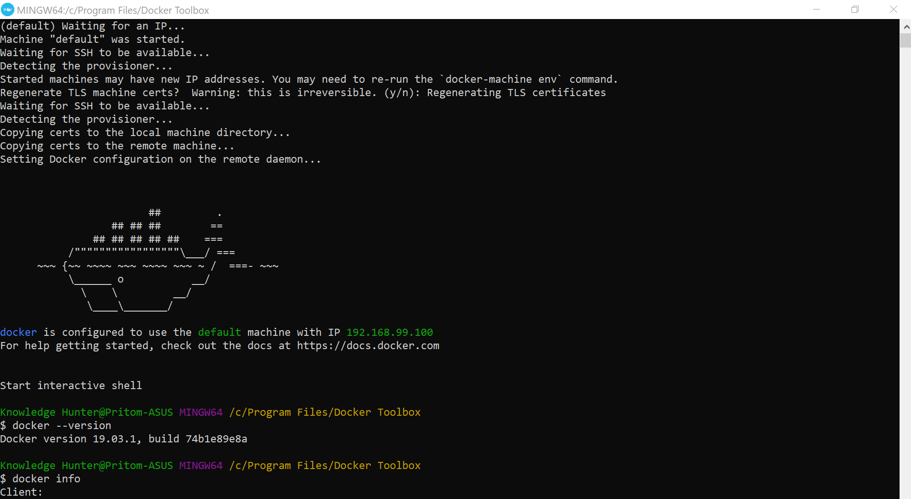

 [![LinkedIn][linkedin-shield]][linkedin-url]

<!-- PROJECT LOGO -->
<br />

<p align="center">
  
<h2 align="center"><i>Building Streaming Data Pipeline using Apache Hadoop, Apache Spark and Kafka on Docker</i></h2>
</p>


</p>

> Apache Hadoop, Apache Spark, Apache ZooKeeper, Kafka, Scala, Python, PySpark PostgreSQL, Docker, Django, Flexmonster, Real Time Streaming, Data Pipeline, Dashboard


<!-- ABOUT THE PROJECT -->

## About The Project
Building Real Time Data Pipeline Using Apache Kafka, Apache Spark, Hadoop, PostgreSQL, Django and Flexmonster on Docker

### Project Description


* In many data centers, different type of servers generate large amount of data(events, Event in this case is status of the server in the data center) in real-time.

* There is always a need to process these data in real-time and generate insights which will be used by the server/data center monitoring people and they have to track these server's status regularly and find the resolution in case of issues occurring, for better server stability.

* Since the data is huge and coming in real-time, we need to choose the right architecture with scalable storage and computation frameworks/technologies.

* Hence we want to build the Real Time Data Pipeline Using Apache Kafka, Apache Spark, Hadoop, PostgreSQL, Django and Flexmonster on Docker to generate insights out of this data.

* The Spark Project/Data Pipeline is built using Apache Spark with Scala and PySpark on Apache Hadoop Cluster which is on top of Docker.

* Data Visualization is built using Django Web Framework and Flexmonster.
### Built With

* Apache Hadoop
* Apache Spark
* Apache ZooKeeper
* Docker
* Kafka
* Django
* Flexmonster
* Scala
* Python
* PySpark

### Environment Setup

#### (a) Docker Setup
Installed Docker Toolbox (https://github.com/docker/toolbox/releases) for Windows 10 Home Edition Operating System. Faced the following issue after installation :


To fix the issue, first enable "Virtualization" from BIOS if it is disabled. Strangley, the "hypervisor" needed to be manually turned "Off", if it is turned "Auto". Use the following link to fix the issue if facing the same problem (https://github.com/docker/toolbox/issues/745).

After successful installation:


#### (b) Create Single Node Kafka Cluster in Local Machine
Run the following script in the created Docker Terminal:
docker network create --subnet=172.20.0.0/16 datamakingnet # create custom network

1. Create ZooKeeper Container

docker pull zookeeper:3.4

docker run -d --hostname zookeepernode --net datamakingnet --ip 172.20.1.3 --name datamaking_zookeeper --publish 2181:2181 zookeeper:3.4


2. Create Kafka Container

docker pull ches/kafka

docker run -d --hostname kafkanode --net datamakingnet --ip 172.20.1.4 --name datamaking_kafka --publish 9092:9092 --publish 7203:7203 --env KAFKA_ADVERTISED_HOST_NAME=192.168.99.100 --env ZOOKEEPER_IP=192.168.99.100 ches/kafka


docker images

docker ps

docker ps -a

Files in this repository:

|     File / Folder      |                         Description                          |
| :--------------------: | :----------------------------------------------------------: |
|1. Create ZooKeeper Container    |  Folder at the root of the project, where images are stored  |
| aws_cluster_create.py  | Creates and sets up a Redshift cluster on AWS with proper configurations |
| aws_cluster_destroy.py |       Destorys the Redshift cluster on AWS, if exists        |
|     sql_queries.py     | Contains the SQL queries for staging, schema definition and ETL |
|    create_tables.py    | Drops and creates tables on AWS Redshift (Reset the tables)  |
|         etl.py         | Stages and transforms the data from S3 buckets and loads them into tables |
|       analyze.py       | Basic querying from all tables created to ensure their validity |
|        dwh.cfg         |              Sample configuration file for AWS               |
|         README         |                         Readme file                          |


```

#### Log Dataset

Logs dataset is generated by [Event Simulator](https://github.com/Interana/eventsim). These log files in JSON format simulate activity logs from a music streaming application based on specified configurations. The dataset is hosted at S3 bucket `s3://udacity-dend/log_data`.

Sample Record :

```
{"artist": null, "auth": "Logged In", "firstName": "Walter", "gender": "M", "itemInSession": 0, "lastName": "Frye", "length": null, "level": "free", "location": "San Francisco-Oakland-Hayward, CA", "method": "GET","page": "Home", "registration": 1540919166796.0, "sessionId": 38, "song": null, "status": 200, "ts": 1541105830796, "userAgent": "\"Mozilla\/5.0 (Macintosh; Intel Mac OS X 10_9_4) AppleWebKit\/537.36 (KHTML, like Gecko) Chrome\/36.0.1985.143 Safari\/537.36\"", "userId": "39"}
```


## Database Schema Design

### Data Model ERD

The Star Database Schema (Fact and Dimension Schema) is used for data modeling in this ETL pipeline. There is one fact table containing all the metrics (facts) associated to each event (user actions), and four dimensions tables, containing associated information such as user name, artist name, song meta-data etc. This model enables to search the database schema with the minimum number of *SQL JOIN*s possible and enable fast read queries. The amount of data we need to analyze is not big enough to require big data solutions or NoSQL databases.

The data stored on S3 buckets is extracted to staging tables `staging_events` and `staging_songs` on Redshift. Then the data from these tables are transformed and inserted into the fact and dimensional tables. An entity relationship diagram (ERD) of the data model is given below. 


## Project structure

Files in this repository:

|     File / Folder      |                         Description                          |
| :--------------------: | :----------------------------------------------------------: |
|         images         |  Folder at the root of the project, where images are stored  |
| aws_cluster_create.py  | Creates and sets up a Redshift cluster on AWS with proper configurations |
| aws_cluster_destroy.py |       Destorys the Redshift cluster on AWS, if exists        |
|     sql_queries.py     | Contains the SQL queries for staging, schema definition and ETL |
|    create_tables.py    | Drops and creates tables on AWS Redshift (Reset the tables)  |
|         etl.py         | Stages and transforms the data from S3 buckets and loads them into tables |
|       analyze.py       | Basic querying from all tables created to ensure their validity |
|        dwh.cfg         |              Sample configuration file for AWS               |
|         README         |                         Readme file                          |


<!-- GETTING STARTED -->

## Getting Started

Clone the repository into a local machine using

```sh
git clone https://github.com/PritomDas/Mastery-in-Data-Engineering/tree/master/Udacity%20Data%20Engineering%20Nano%20Degree
```

### Prerequisites

These are the prerequisites to run the program.

* python 3.8.2 ( as of my current installation )
* PostgreSQL
* AWS account
* psycopg2 python library
* boto3 python library

### How to run

Follow the steps to extract and load the data into the data model.

1. Navigate to `Project 3 Data Warehouse on AWS` folder

2. Edit the `dwh.cfg` configuration file and fill in the AWS Access Key and Secret Key fields

3. Run `aws_cluster_create.py` to create the clusters on AWS by

   ```python
   python aws_cluster_create.py
   ```

   The type, number of nodes and other specifications of cluster will be as per the configuration file. Wait till cluster creation confirmation is displayed.

4. Run `create_tables.py` to create/reset the tables by

   ```python
   python create_tables.py
   ```

5. Run ETL process and load data into database by 

   ```python
   python etl.py
   ```

   This will execute SQL queries corresponding to staging data from S3 on Redshift and to transform and insert into the Postgres tables on Redshift.

6. Run `analyze.py` to validate the entry of data into tables by 

   ```python
   python analyze.py
   ```

    This runs some sample queries from all the tables created.

7. Run `aws_cluster_destroy.py` to destroy the clusters on AWS by

   ```python
   python aws_cluster_destroy.py
   ```


<!-- CONTACT -->

## Contact

Pritom Das Radheshyam - [Portfolio Website](https://pritom.uwu.ai/)


<!-- MARKDOWN LINKS & IMAGES -->
<!-- https://www.markdownguide.org/basic-syntax/#reference-style-links -->

[linkedin-shield]: https://img.shields.io/badge/-LinkedIn-black.svg?style=flat-square&logo=linkedin&colorB=555
[linkedin-url]: https://www.linkedin.com/in/you-found-pritom
[product-screenshot]: images/screenshot.jpg
